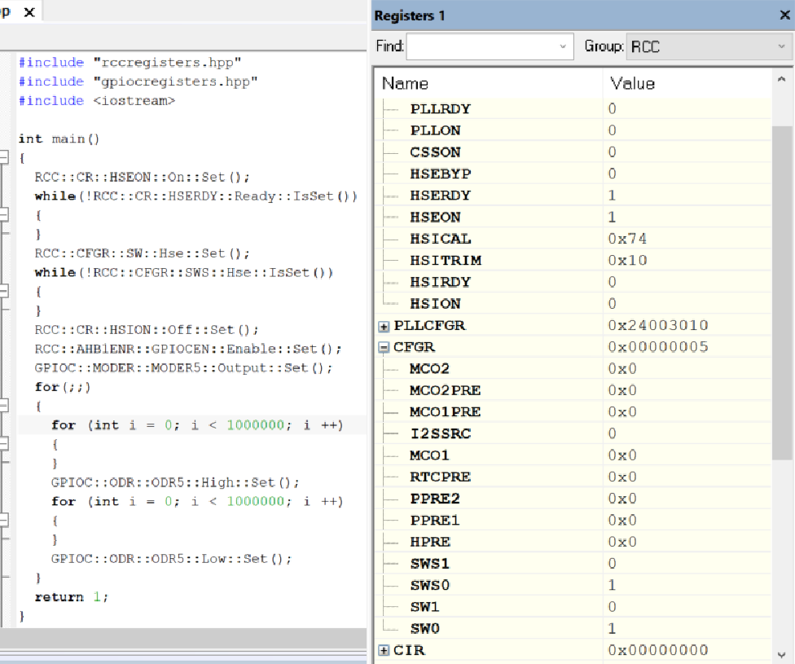
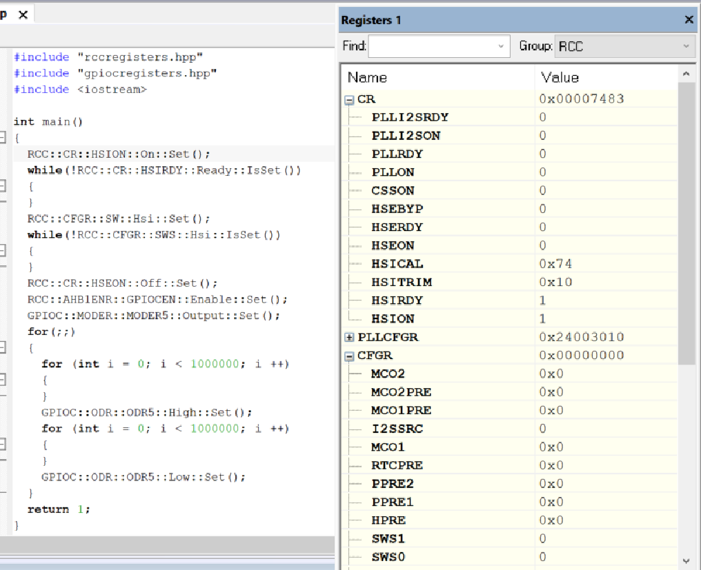
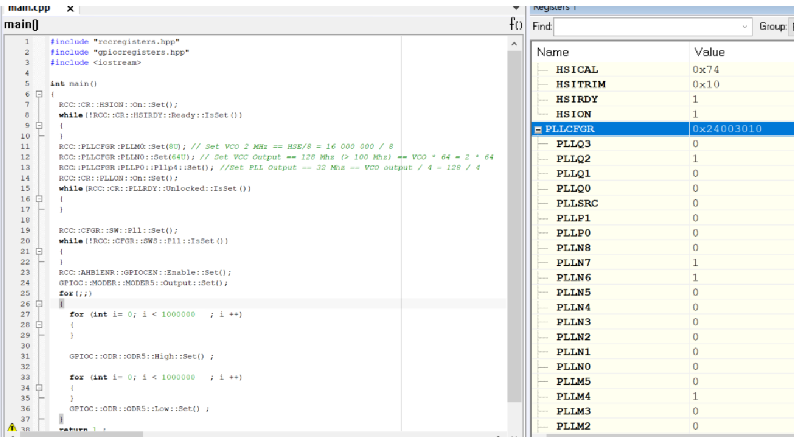
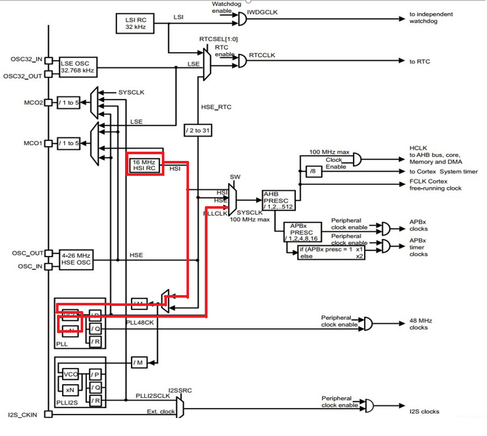
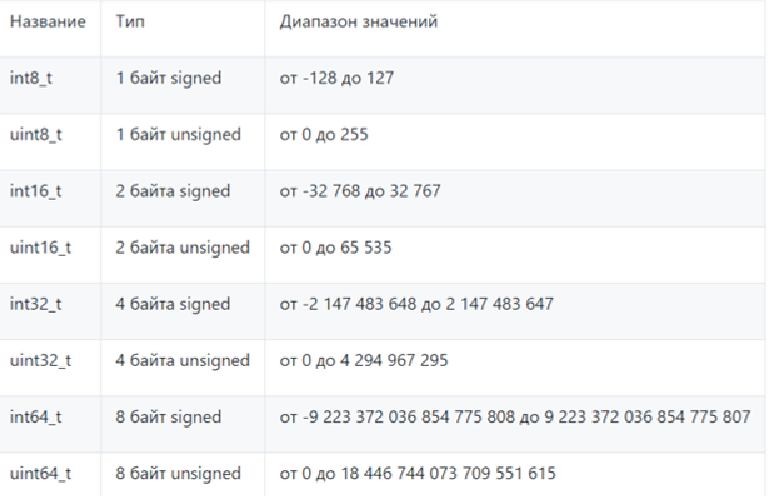
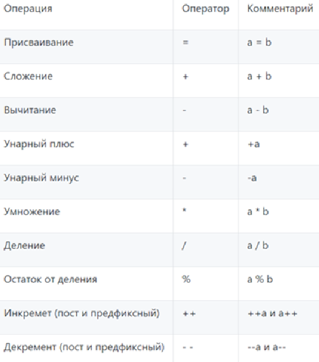
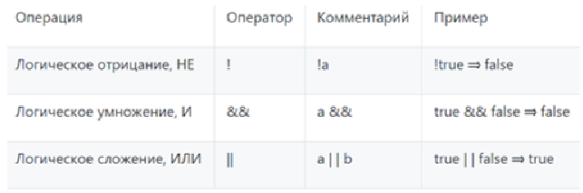
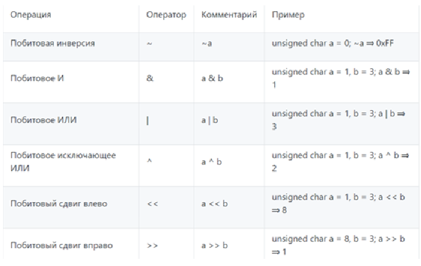
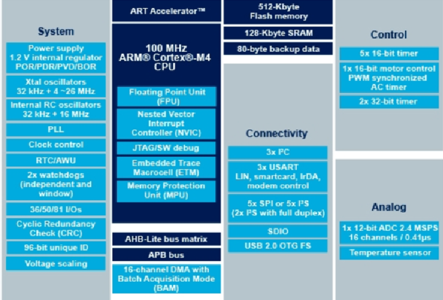
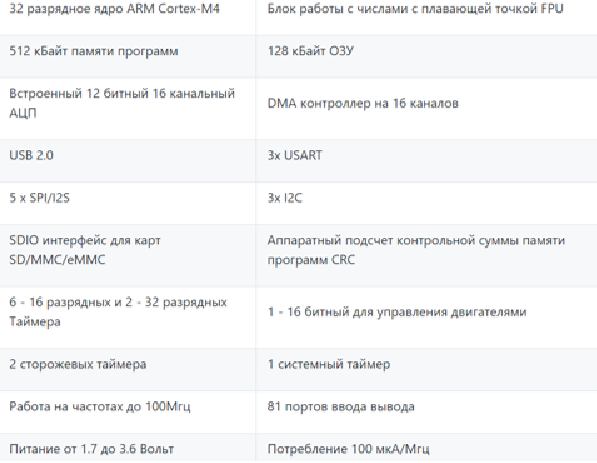

==    *_Домашняя работа_* ==
---

Создан и настроен проект в IAR Workbench.

1.Задание: _Настроить внешний источник частоты HSE и подключить его на системную шину
Прошить программу морганиями светодиодом - проверить, что они моргают._

.Код для работы с HSE

Запустив программу видим, светодиод на плате стал мигать.
Частота  HSE, то есть внешнего высокочастотного генератора частоты установлена _8 МГц._

2.Задание: _Настроить внутренний источник частоты HSI и подключить его на системную шину.
Прошить программу морганиями светодиодом - проверить, что они моргают быстрее в 2 раза._

Меняем код и запускаем программу.

.Код для работы с HSI

Запустив программу видим,что светодиод на плате стал мигать приблизительно в 2 раза быстрее, по отношению к запуску через HSE.

Частота  HSI, то есть  высокочастотного RC-генератора частоты установлена _16 МГц._

3.Задание: _Настроить PLL источник тактовой частоты на 32 Мгц и подключить его на системную шину.
Прошить программу морганиями светодиодом - проверить, что они моргают  еще в 2 раза быстрее чем в пункте 2._

.Код для работы с PLL

По итогу работы программы, светодиод зрительно стал мигать в 2 раза быстрее чем при пункте с HSI.
Это получилось благодаря настройке PLL на необходимую частоту равную _32 МГц_. Для установки этой частоты использовался RC-генератор HSI с частотой _16 МГц_.
Рисунок ниже:

=== Ответы на воросы по лекции

1.*Что такое POD типы данных?*

POD - (Plain Old Data) это тип данных который имеет простую структуру.

2.*Назовите все виды типов в языке С++*

простые:

•	целые (bool, char, int, enim, long, short, long long)

•	с плавающей точкой (float, double, long double)

структурированные (array, union, class/structure)

адресные (pointer, reference)

3.*Что такое пользовательский тип?*

Можем определить свой тип сами, либо сделать псевдоним типа. Любой класс или структура, определенная нами, будет являться нашим типом. Пользовательский тип делается вручную и может иметь любой псевдоним.

4.*Назовите модификаторы типов.*

short int – целочисленное знаковое значение укороченной длины,

unsigned short int – целочисленное беззнаковое значение укороченной длины,

long int – выбор по умолчанию для целочисленных значений. На платформах на которых int равен по длине unsigned short int может быть длиннее int,

unsigned long int – целое число двойной длины. На платформах на которых int равен по длине unsigned short int может быть длиннее int,

long double – число с плавающей точкой двойной точности с двойной точностью.

5.*Назовите правило установки размеров типов*

Размеры типов не четко определены и могут отличаться для различных микроконтроллеров. Для размеров типов существует правило:

1             <= sizeof(char)     <= sizeof(short) <= sizeof(int) <= sizeof(long)

1             <= sizeof(bool)     <= sizeof(long)

sizeof(char)  <= sizeof(long)

sizeof(float) <= sizeof(double)   <= sizeof(long double)

sizeof(T)     == sizeof(signed T) == sizeof(unsigned T)

6.*Что делает оператор sizeof()?*

Данный унарный оператор используют для вычисления и возвращает размер определённой переменной или определённого типа данных в байтах.

7.*Что характеризует тип std::size_t*

std::size_t – целочисленный беззнаковый тип результата, возвращаемого операторами sizeof. Может хранить максимальный размер теоретически возможного объекта любого типа (включая массивы). С++ определяет size_t в пространстве имен std.

8.*Назовите фиксированные типы целых в библиотеке std*

9.*Что такое псевдоним типа?*

Псевдоним типа является именем, ссылающимся на ранее определённый тип, используется для повышения удобства обращения к пользовательским и встроенным типам данных.

10.*Что такое явное и неявное преобразование типа?*

Неявное преобразование типов данных выполняет компилятор С++, (int a = 3.14;) а явное преобразование данных выполняет сам программист (int a = static_cast<int>(3.14);).

11.*Какие явные преобразования типов вы знаете?*

static_cast, const_cast, reinterpret_cast, dynamic_cast

12.*Что делает reinterpret_cast?*

reinterpret_cast преобразует типы, несовместимыми друг с другом, и используется для преобразования:

•	В свой собственный тип

•	Указателя в интегральный тип

•	Интегрального типа в указатель

•	Указателя одного типа в указатель другого типа

•	Указателя на функцию одного типа в указатель на функцию другого типа

13.*Чем static_cast отличается от reinterpret_cast?*

static_cast преобразует выражения одного статического типа в объекты и значения другого статического типа. Проверка производится на уровне компиляции, так что в случае ошибки сообщение будет получено в момент сборки приложения или библиотеки. Используется для близких типов.

reinterpret_cast — приведение типов без проверки, непосредственное указание компилятору. Применяется только в случае полной уверенности программиста в собственных действиях. Используется для несовместимых типов.

14.*Что такое ОЗУ и ПЗУ?*

ОЗУ – опертивное запоминающее устройство (RAM). предназначена для хранения информации, изменяющейся в ходе выполнения процессором операций по ее обработке. Используется как для чтения, так и для записи информации.

Энергозависима, то есть вся информация хранится в этой памяти только тогда, когда компьютер включен.

ПЗУ – постоянное запоминающее устройство (ROM). служит для хранения программ начальной загрузки компьютера и тестирования его узлов. Используется только для чтения.

Энергонезависима, то есть записанная в ней информация не изменяется после выключения компьютера.

15.*Каков размер памяти ARM Cortex микроконтроллеров.*

Ядро ARM имеет 4 Гбайт последовательной памяти с адресов 0x00000000 до 0xFFFFFFFF.

16.*По какой архитектуре разработан ARM Cortex микроконтроллер?*

По Гарвардской модифицированной архитектуре.

17.*В чем отличие Гарвардской архитектуры от Архитектура ФонНеймана?*

Архитектура Фон Неймана. Эта архитектура состоит из единого блока памяти, в котором хранятся и команды, и данные, и общей шины для передачи данных и команд в ЦПУ и от него. При такой архитектуре перемножение двухчисел требует по меньшей мере трех циклов: двух циклов для передачи двух чисел в ЦПУ, и одного – для передачи команды. Данная архитектура приемлема в том случае, когда все действия могут выполняться последовательно.
Гарвардская архитектура. Данные и код программы хранятся в различных блоках памяти и доступ к ним осуществляется через разные шины, как показано на схеме. Т.к. шины работают независимо, выбор команд программы и данных может осуществляться одновременно, повышая таким образом скорость по сравнению со случаем и спользования одной шины вархитектуре Фон Неймана.

18.*Где располагаются локальные переменные?*

Локальные переменные функции создаются на стеке или в регистрах.

19.*Где располагаются статические переменные?*

инициализируемые - .data

инициализируемые нулем - .bss данные переменные не изменяются до конца работы приложения.

20.*Где располагаются глобальные переменные?*

инициализируемые - .data

инициализируемые нулем - .bss

21.*Что такое стек?*

Стек – это организация памяти, выполненная компоновщиком. На уровне микроконтроллера для работы со стеком есть специальные ассемблерные команды (например PUSH – положить регистры в стек, и POP – взять из стека).
Так же для сохранения и считывания данных из стека могут использоваться инструкции STR и LDR.

22.*Что такое указатель?*

Указатель это переменная, которая хранит адрес какой-то другой переменной.

23.*Что такое разыменовывание указателя?*

Операция, нужная для того, чтобы получить значение, записанное в некоторой области, на которое ссылается указатель

24.*Что означает взятие адреса?*

Оператор & - оператор взятия адреса.
& перед переменной передает адрес по которому лежат значения этой переменной.

25.*Какие операции можно выполнять над указателями?*

Указатели можно складывать+, вычитать -, увеличивать ++, сравнивать !=. Но указатели должны быть одного типа/

26.*Что такое константный указатель?*
Константный указатель — это указатель, значение которого не может быть изменено после инициализации. Для объявления константного указателя используется ключевое слово const между звёздочкой и именем указателя:
int * const ptr = &value1;

27.*Что такое указатель на константу?*

Указатель на константное значение — это неконстантный указатель, который указывает на неизменное значение. Для объявления указателя на константное значение, используется ключевое слово const перед типом данных:

const int *ptr = &value;

28.*Что такое ссылка? В чем её отличие от указателя?*

Ссылка – это тип переменной в C, который работает как псевдоним другого объекта или значения. Ссылка – это тот же указатель, который неявно разыменовывается при доступе к значению, на которое он указывает
Поскольку ссылки должны быть инициализированы корректными объектами (они не могут быть нулевыми) и не могут быть изменены позже, то они, как правило, безопаснее указателей (так как риск разыменования нулевого указателя отпадает). Однако, они немного ограничены в функциональности, по сравнению с указателями.
Если определённое задание может быть решено с помощью как ссылок, так и указателей, то лучше использовать ссылки. Указатели следует использовать в ситуациях, только когда ссылки недостаточно эффективны (например, при динамическом выделении памяти).

29.*Что такое регистр?*

Регистр - это определенный участок памяти внутри самого процессора, от 8-ми до 32-х бит длиной, который используется для промежуточного хранения информации, обрабатываемой процессором. Некоторые регистры содержат только определенную информацию.
Каждый регистр в архитектуре ARM представляет собой ресурс памяти и имеет длину в 32 бита, где каждый бит можно представить в виде выключателя с помощью которого осуществляется управление тем или иным параметром микроконтроллера.

30.*Что такое регистры общего назначения?*

Регистры общего назначения - это сверхбыстрая память внутри процессора, предназначенная для хранения адресов и промежуточных результатов вычислений (регистр общего назначения/регистр данных) или данных, необходимых для работы самого процессора.

31.*Что такое регистры специального назначения?*

Регистры специального назначения расположены в ОЗУ микроконтроллера и используются для управления процессором и периферийными устройствами

32.*Как можно установить бит в регистре специального назначения?*

Так как регистр специального назначения – это просто адресуемая ячейка памяти, то в коде это может мы можем обратиться к данным по этому адресу, разыменовывая указатель, указывающий на этот адрес.

33.*Объясните как вызывается функция.*

Функция должна быть объявлена в таком порядке, чтобы компилятор мог узнать как её вызвать. Объявление функции может выглядеть следующим образом:

int MyFunction(int first, int second);

Все что знает об этой функции компилятор, это то, что она принимает два параметра: целое и указатель на символ. И функция должна вернуть целое значение. Этого достаточно для компилятора, чтобы понять как вызвать эту функцию.

Чтобы вызвать функцию, следует записать:

MyFunction(1,2);

34.*Что такое трансляция?*

Трансляция программы - это преобразование программы, представленной на одном из языков программирования, в программу на другом языке, в определенном смысле равносильную первой.

35.*Что такое компоновка?*

Компоновка – объединение объектных файлов в исполняемый.

36.*Как лучше организовывать структуру проекта и почему?*

При создании структуры проекта стоит соблюдать иерархическую структуру файлов, хранящихся на компьюетере. Это позволяет облегчить поиск требуемых компонентов. Структура должна иметь иерархическую модель. Все существующие подгруппы разбивают файлы на логические группы.

37.*Что такое операторы?*

Оператор — это символ, который сообщает компилятору о необходимости выполнения некоторых математических или логических действий.

38.*Какие арифметические операторы вы знаете?*

39.*Какие логические операторы вы знаете?*

40.*Какие побитовые операторы вы знаете?*

41.*Приведите пример переопределения оператора*

class Integer // создание класса Integer

{

private: // модификатор доступа. доступ открыт самому классу.

int value; // переменная типа int с названием value

public: //модификатор доступа. доступ открыт классам, производным от данного.

Integer(int i): value(i)

{}

const Integer operator+(const Integer& rv) const {return (value + rv.value); //переопределение +

}
};

42.*Какие еще операторы вы знаете?*

Составное присваивание
Операторы работы с указателями и членами класса
Функторы, тернарные операции, sizeof(), запятая, приведение типа, new

43.*Как сбросить бит с помощью битовых операторов?*

битовый И и отрицание:
PORTB &= ~1; // сбрасывает 0-ой бит в PORT

44.*Как установить бит с помощью битовых операторов?*

битовый ИЛИ:
PORT | = 1; // устанавливает 0-ой бит в PORT

45.*Как поменять значение бита с помощью битовых операторов?*

операция инвертирования:
PORTB ^= 1; // меняет значение в 0-ой бите в PORT

46.*Какой микроконтроллер на отладочной плате XNUCLE ST32F411?*

STM32F411RE

47.*Какие блоки входят в состав микроконтроллера STM32F411?*

48.*В чем отличие ядра CortexM4 от CortexM3?*

В CortexM4 присутствует аппаратный модуль работы с плавающей точкой и набор инструкций DSP, SIMD, FP.

49.*Назовите основные характеристики микроконтроллера STM32F411.*

50.*Назовите дополнительные характеристики микроконтроллера STM32F411.*

Настраиваемые источники тактовой частоты,
Настраиваемые на различные функции порты,
Внутренний температурный сенсор,
Таймеры с настраиваемым модулем ШИМ,
DMA для работы с модулями (SPI, UART, ADC… ),
12 разрядный ADC последовательного приближения,
Часы реального времени,

51.*Какие источники тактирования есть у микроконтроллера STM32F411*

3 основных источника:

HSI (high-speed internal) — внутренний высокочастотный RC-генератор.

HSE (high-speed external) — внешний высокочастотный генератор.

PLL — система ФАПЧ. Точнее сказать, набор из умножителей и делителей, исходный сигнал он получает от HSI или HSE, а на выходе у него уже другая частота.

2 вторичных источника:

LSI (low-speed internal) — низкочастотный внутренний RC-генератор на 37 кГц

LSE (low-speed external) — низкочастотный внешний источник на 32,768 кГц

52.*Назовите алгоритм подключения системной частоты к источнику тактирования микроконтроллера STM32F411.*

Алгоритм настройки частоты :

• Определить какие источники частоты нужны

• Включить нужный источник используя Clock Control register (RCC::CR)

• Дождаться стабилизации источника используя соответствующие биты (..RDY) Clock Control register (RCC::CR)

• Назначить нужный источник на системную частоту используя Clock Configuration Register (RCC::CFGR)

• Дождаться пока источник не переключиться на системную частоту используя Clock Configuration Register (RCC::CFGR)

53.*Что такое ФАПЧ?*

Фазовая автоподстройка частоты (ФАПЧ, англ. PLL ) — система автоматического регулирования, подстраивающая фазу управляемого генератора так, чтобы она была равна фазе опорного сигнала, либо отличалась на известную функцию от времени.

54.*Что делает следующий код?*

int main()

{

int StudentUdacha = 10;

int PrepodUdachca = 0 ;

StudentUdacha =  StudentUdacha ^ PrepodUdachca ;

PrepodUdachca =  StudentUdacha ^ PrepodUdachca ;

StudentUdacha ^= PrepodUdachca ;

}

Последовательность:

Переменной StudentUdacha присваиваем значение 10 .
Далее присваиваем переменной PrepodUdachca значение 0.
Операцией исключающего ИЛИ записываем в переменную StudentUdacha значение 10.
В переменную PrepodUdachca операцией исключающего ИЛИ записываем значение 10.
Используя инверсию записываем в переменную StudentUdacha значение 0.

